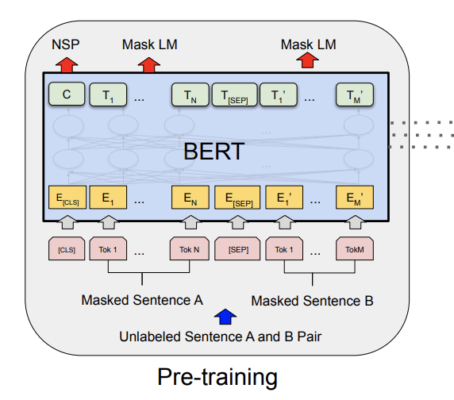

# Sentiment Classification of IMDB Reviews Using DistilBERT

[](https://app.layer.ai/douglas_mcilwraith/bert-text-classification/) [](https://colab.research.google.com/github/layerai/examples/blob/main/bert-text-classification/distilbert-imdb.ipynb) [](https://github.com/layerai/examples/tree/main/bert-text-classification)

In this example we use the [DistilBERT](https://arxiv.org/abs/1910.01108) language model, a smaller, faster a variant of the popular [BERT](https://arxiv.org/abs/1810.04805) (Bidirectional Encoder Representations from Transformers) model.

BERT provides contextualised language embeddings. That is to say, that the use of the same word in a different sentence will provide a different embedding. It is trained by minimising the loss of two tasks 1) the prediction of masked words in a sentence and 2) next sentence prediction. DistilBERT is a 'distilled' version of BERT which reduces the size of a BERT model by 40% through the use of a knowledge distillation process.

We use the pretrained [`distilbert-base-uncased`](https://huggingface.co/distilbert-base-uncased) from HuggingFace. This model has been trained on the `wikipedia` and `bookcorpus` dataset. We then fine-tune this model on a sentiment classification task using a subset of the popular [`imdb`](https://huggingface.co/datasets/imdb) dataset. This dataset provides a total of 50000 (half train, half test) highly polar movie reviews and labelled their sentiment (positive vs negative). Testing is performed over 5 folds of the test set and the results are logged in Layer. 


## How To Use

First make sure you have the latest version of Layer:

```python
!pip install layer -q
```

Datasets can be uploaded to layer as follows. For this project, we use the 50% split of train/test data to create two Layer datasets. `imdb-train` and `imdb-test`. The following code illustrates the process for one of these datasets.

```python
@dataset("imdb-train")
@pip_requirements(packages=["datasets"])
def build():
    from datasets import load_dataset
    import pandas as pd

    ds = load_dataset("imdb")['train']
    df = pd.DataFrame(ds)
    return df

layer.run([build])
```

We provide two `@model` code blocks within the example. The first, entitled `bert-fine-tune` takes the pretrained model as above and fine tunes this model for the binary classification task on a random 10% sample of the training set `imdb-train`. The second code block is designated as `distilbert-evaluation` and evaluates the model that results from fine-tuning against the test set `imdb-test`. This is performed by taking 5 folds from the test data and collecting metrics against the binary classification task. These Metrics are logged to Layer under the [model home page](https://app.layer.ai/douglas_mcilwraith/distilbert-imdb/models/distilbert-evaluation#results). 


## Dataset

The dataset used in this project is hosted by Huggingface as simply [`imdb`](https://huggingface.co/datasets/imdb). The original dataset is provided by [Stanford University](https://ai.stanford.edu/~amaas/data/sentiment/) and is managed by [Andrew Maas](https://ai.stanford.edu/~amaas/). We provide an excerpt as follows, however more detail can be found on the Layer dataset home pages for [train](https://app.layer.ai/douglas_mcilwraith/distilbert-imdb/datasets/imdb-train) and [test](https://app.layer.ai/douglas_mcilwraith/distilbert-imdb/datasets/imdb-test)

|text|label|
|---|---|
|I rented I AM CURIOUS-YELLOW from my video store because... | 0 |
|"I Am Curious: Yellow" is a risible and pretentious steaming pile...| 0 |

Source: [Dataset Home Page](https://ai.stanford.edu/~amaas/data/sentiment/)

## Model

As DistilBERT is a derivative of BERT, we will first discuss the overall archtitecture of BERT, before discussing how DistilBERT achieves a 40% reduction in model size.

BERT is a multi layer, bidirectional Transformer encoder, based upon the implementation described my [Vaswani et al.](https://papers.nips.cc/paper/2017/hash/3f5ee243547dee91fbd053c1c4a845aa-Abstract.html). The following figure shows the overall architecture for BERT, and alludes to how BERT can be used for both next sentence prediction as well as a language model.



As you will see, the input representation toward the bottom of the image, is able to represent both single sentences and multiple sentences, such as question answer pairs. BERT provides a learned representation which is trained by minimising the error of two types of tasks. The first is known as 'Next Sentence Prediction' or NSP, the second 'Masked Language Model. The aim of the first such tasks is to provide the next sequence of words, given the first sequence. The aim of the second is to 'infill' words that have been masked out. By minimsing the error across these tasks, an embedding is learned which is able to capture the context of a particular word. Such embeddings can then be fined tuned for particular language tasks. This proceeds by updating the pre trained model weights to create a new embedding tailored to the tasks at hand.

Source: [Bert Paper](https://arxiv.org/abs/1810.04805)
Source: [DistilBERT Paper](https://arxiv.org/abs/1910.01108)

### References

- Devlin, Jacob, Ming-Wei Chang, Kenton Lee and Kristina Toutanova. “BERT: Pre-training of Deep Bidirectional Transformers for Language Understanding.” ArXiv abs/1810.04805 (2019)
- Sanh, Victor, Lysandre Debut, Julien Chaumond and Thomas Wolf. “DistilBERT, a distilled version of BERT: smaller, faster, cheaper and lighter.” ArXiv abs/1910.01108 (2019):

