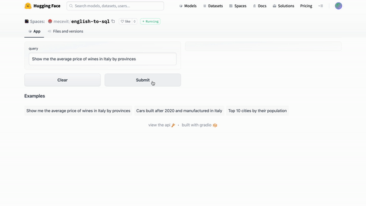

# Deploy Layer models with Gradio
[](https://app.layer.ai/layer/t5-fine-tuning-with-layer) [](https://colab.research.google.com/github/layerai/examples/blob/main/translation/T5_Fine_tuning_with_Layer.ipynb) [](https://github.com/layerai/examples/tree/main/translation)

## How to deploy
Ensure that you have the latest version of Layer and Gradio installed.
```
pip install layer-sdk gradio
```

Sample application code: 
[](https://colab.research.google.com/drive/1Q6wiwdyjPGbfABpsNwOBzhhWE5pQTdrC?usp=sharing) [](https://huggingface.co/spaces/mecevit/english-to-sql) 
```python
import gradio as gr
import layer

query = "Show me the average price of wines in Italy by provinces"

model = layer.get_model('layer/t5-fine-tuning-with-layer/models/t5-english-to-sql').get_train()
tokenizer = layer.get_model('layer/t5-fine-tuning-with-layer/models/t5-tokenizer').get_train()

def greet(query):
    input_ids = tokenizer.encode(f"translate English to SQL: {query}", return_tensors="pt")
    outputs = model.generate(input_ids, max_length=1024)
    sql = tokenizer.decode(outputs[0], skip_special_tokens=True)
    return sql


iface = gr.Interface(fn=greet, inputs="text", outputs="text", examples=[
    "Show me the average price of wines in Italy by provinces",
    "Cars built after 2020 and manufactured in Italy",
    "Top 10 cities by their population"
])
iface.launch()
```
