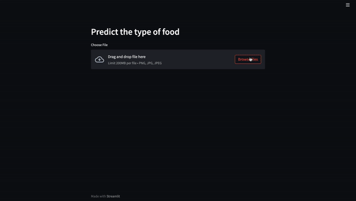

# How to deploy Layer models using Streamlit 
[](https://app.layer.ai/layer/image-classification) [](https://colab.research.google.com/github/layerai/examples/blob/main/food-vision/food-vision.ipynb) [](https://github.com/layerai/examples/tree/main/food-vision)

## How to deploy
Ensure that you have the latest version of Layer and Streamlit installed.
```
pip install layer-sdk streamlit
```

Sample application code: 

[](https://colab.research.google.com/drive/1KTZ3h_4OefZrQggURfr_eJClZlXp4V6g?usp=sharing) [](https://huggingface.co/spaces/mwitiderrick/food-vision) 
```python
import streamlit as st
from PIL import Image
import layer
import numpy as np
from keras.preprocessing import image
import tensorflow as tf

st.header("Predict the type of food")


def main():
    file_uploaded = st.file_uploader("Choose File", type=["png", "jpg", "jpeg"])

    if file_uploaded is not None:
        food_image = Image.open(file_uploaded)
        predictions = predict(food_image)
        st.write(predictions)
        st.image(food_image, caption='Food image')


def predict(food_image):
    model = layer.get_model('layer/image-classification/models/food-vision').get_train()
    test_image = food_image.resize((200, 200))
    test_image = image.img_to_array(test_image)
    test_image = test_image / 255.0
    test_image = np.expand_dims(test_image, axis=0)
    class_names = ['chicken_curry', 'oysters', 'tuna_tartare', 'pho', 'fried_rice', 'hot_and_sour_soup','seaweed_salad', 'baklava', 'eggs_benedict', 'panna_cotta', 'onion_rings', 'lasagna', 'foie_gras', 'churros', 'donuts', 'spring_rolls', 'gyoza', 'ice_cream', 'dumplings', 'ceviche''ramen', 'nachos','greek_salad', 'scallops', 'chocolate_mousse', 'grilled_cheese_sandwich', 'cheesecake', 'steak','hummus', 'bread_pudding', 'frozen_yogurt', 'falafel', 'paella', 'pulled_pork_sandwich', 'bibimbap','risotto', 'macarons', 'garlic_bread', 'beef_carpaccio', 'red_velvet_cake', 'ravioli', 'waffles','grilled_salmon', 'tacos', 'lobster_bisque', 'sushi', 'clam_chowder', 'sashimi', 'french_onion_soup','french_fries', 'tiramisu', 'takoyaki', 'chicken_quesadilla', 'chicken_wings', 'pizza', 'pork_chop','crab_cakes', 'cannoli', 'beignets', 'miso_soup', 'mussels', 'strawberry_shortcake', 'caprese_salad','gnocchi', 'deviled_eggs', 'macaroni_and_cheese', 'fish_and_chips', 'beef_tartare', 'guacamole','hamburger', 'club_sandwich', 'edamame', 'cheese_plate', 'peking_duck', 'fried_calamari','prime_rib', 'caesar_salad', 'beet_salad', 'lobster_roll_sandwich', 'pancakes', 'samosa','french_toast', 'omelette', 'croque_madame', 'creme_brulee', 'filet_mignon', 'poutine', 'apple_pie','spaghetti_bolognese', 'bruschetta', 'cup_cakes', 'pad_thai', 'huevos_rancheros', 'baby_back_ribs','chocolate_cake', 'carrot_cake', 'hot_dog', 'spaghetti_carbonara', 'breakfast_burrito','shrimp_and_grits', 'escargots']
    predictions = model.predict(test_image)
    scores = tf.nn.softmax(predictions[0])
    scores = scores.numpy()
    result = f"{class_names[np.argmax(scores)]} with a {(100 * np.max(scores)).round(2)} percent confidence."
    return result


if __name__ == "__main__":
    main()

```
